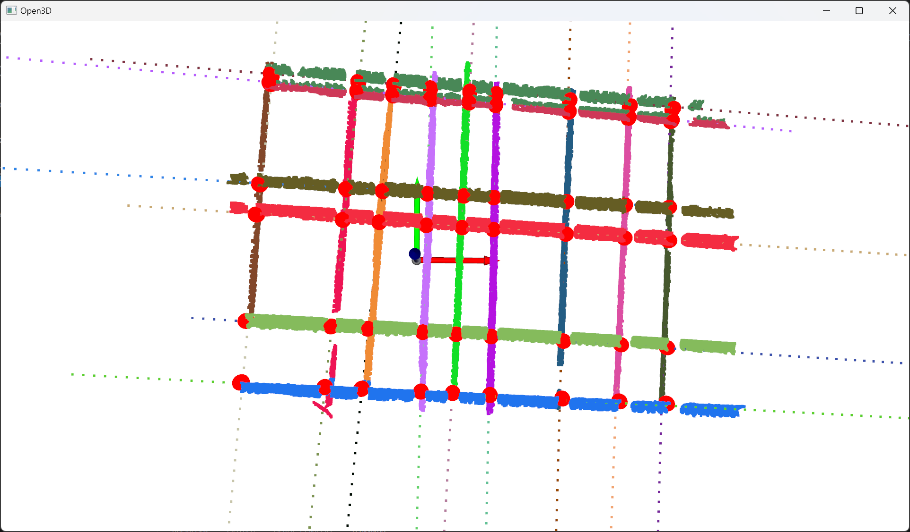
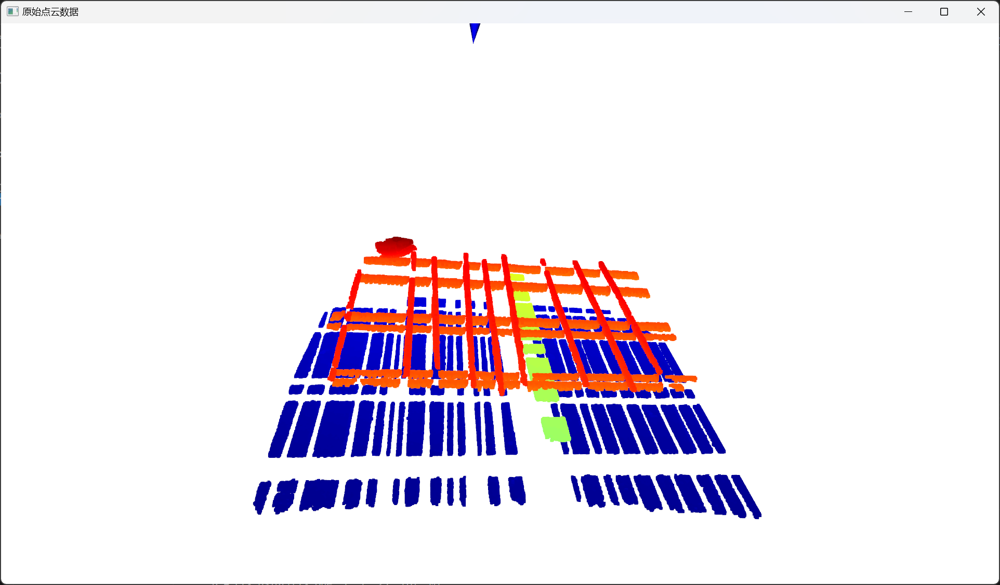
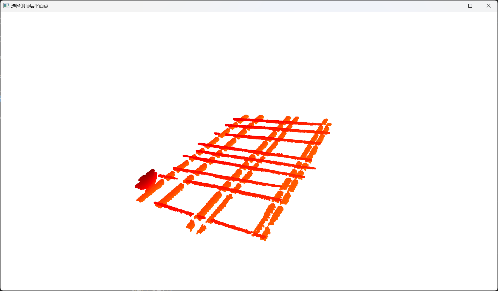
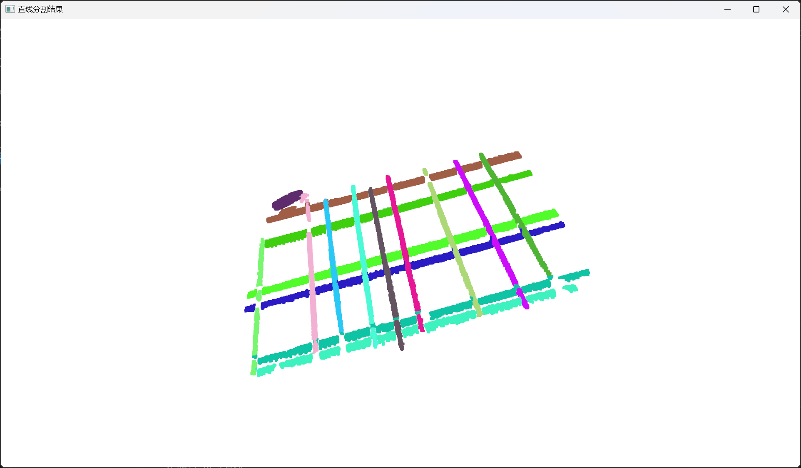
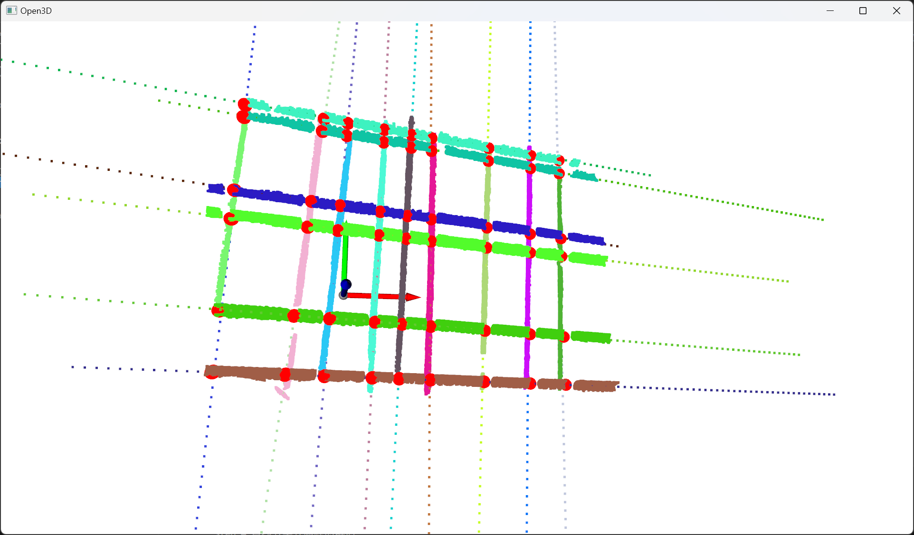

# 钢筋交叉点检测 / Rebar Intersection Detection

基于三维点云的多行多列钢筋网格交汇点检测方法。输入钢筋网的点云，自动分离顶层平面、拟合钢筋直线，并计算两组正交（或近似正交）钢筋的交叉点，可用于绑扎机器人的抓取定位等场景。

> **说明**：本项目最初完成于 **2023.08**。当前借助 AI 辅助开发、并利用尚未用完的 token 额度，对仓库结构、代码组织与可复现流程进行重构与整理。

<p align="center">
  
</p>
<p align="center"><em>交叉点检测结果（红色球体为交点）</em></p>

## 方法流程

1. **顶层平面提取**：迭代 RANSAC 平面分割，按点数过滤后选取平均深度最小的平面作为顶层钢筋层  
2. **多直线拟合**：在顶层点云上用 RANSAC 反复拟合直线，得到各钢筋中心线  
3. **方向聚类与离群剔除**：用方向余弦相似度做 K-Means（两类），剔除偏离主方向的误检直线  
4. **交叉点求解**：对两类直线两两求 XY 平面交点，Z 取两条直线在该处的均值  

## 执行结果示例

以下结果基于仓库自带示例点云 `data/sample/point_cloud_00000.pcd`。

| 步骤 | 可视化 |
|------|--------|
| 原始点云 |  |
| 顶层平面 |  |
| 直线分割 |  |
| 交叉点（Open3D） |  |


**三维结果（点云线段 + 拟合直线 + 交点）：**

<p align="center">
  
</p>

> 可复现绘图：`PYTHONPATH=. python scripts/generate_readme_figures.py`（生成 `docs/images/demo_*.png`）

## 环境配置

推荐使用 Conda：

```bash
# 方式一：从 environment.yml 创建
conda env create -f environment.yml
conda activate rebar_intersection

# 方式二：已有同名环境时，仅安装依赖
conda activate rebar_intersection
pip install -r requirements.txt
```

依赖：`Python 3.10`、`open3d`、`numpy`、`scikit-learn`、`sympy`、`pyransac3d`、`matplotlib`

## 快速开始

```bash
conda activate rebar_intersection

# 使用自带示例点云（无界面，适合服务器 / CI）
python run_detection.py \
  --input data/sample/point_cloud_00000.pcd \
  --output output/intersections.npy

# 本地有显示器时可打开可视化
python run_detection.py --input data/sample/point_cloud_00000.pcd --visualize
```

结果默认写入：

- `output/intersections.npy`：交点坐标，形状 `(N, 3)`
- `output/intersections.json`：可读的 JSON 列表

### 常用参数

| 参数 | 默认值 | 说明 |
|------|--------|------|
| `--plane-dist` | `0.03` | 平面 RANSAC 距离阈值 |
| `--min-plane-points` | `15000` | 保留平面的最少点数 |
| `--line-dist` | `0.015` | 直线 RANSAC 距离阈值 |
| `--min-line-points` | `5000` | 每条有效直线的最少内点 |
| `--outlier-threshold` | `0.997` | 方向相似度离群阈值 |

点云尺度或密度不同时，请优先调整上述阈值。

## 项目结构

```
Rebar-intersection-detection/
├── rebar_intersection/          # 核心算法包
│   ├── plane.py                 # 顶层平面选择
│   ├── lines.py                 # 直线拟合 / 聚类 / 离群剔除
│   ├── crossing.py              # 交叉点计算
│   └── pipeline.py              # 端到端流水线
├── run_detection.py             # 命令行入口
├── data/sample/                 # 示例点云
├── docs/images/                 # README 结果示意图
├── output/                      # 运行输出（默认 gitignore）
├── docs/                        # 方法说明等文档
├── scripts/                     # 工具脚本 / 旧实验代码
├── environment.yml
├── requirements.txt
└── LICENSE
```

## Python API

```python
from rebar_intersection import detect_intersections

result = detect_intersections("data/sample/point_cloud_00000.pcd")
print(result.intersections.shape)   # (N, 3)
print(result.intersections[:5])
```

## 数据说明

仓库自带一份示例点云 `data/sample/point_cloud_00000.pcd`。请使用自己的钢筋网点云时，建议：

- 坐标系中深度方向与示例一致（或相应调整“顶层”判定逻辑）  
- 保证顶层钢筋点数充足，必要时降低 `--min-plane-points` / `--min-line-points`  

## 引用与相关材料

本仓库实现对应「基于点云处理的多行多列钢筋网格交汇点检测」方法。更多说明可参见 `docs/` 目录中的汇报材料。

## License

本项目采用 [MIT License](LICENSE)。
